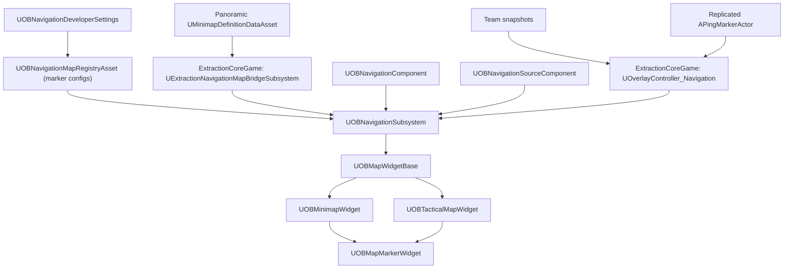

# OBNavigation Plugin

## Overview

**OBNavigation** is the reusable navigation UI core for OBExtraction. It provides runtime map-layer specs, minimap/full-map marker projection, overlay rendering, marker pooling, visibility policy filtering, and data-driven marker configuration. Multiplayer ownership, team, ping, extraction, and loot rules are supplied by game-specific bridge code such as `ExtractionCoreGame`'s `UOverlayController_Navigation`.

The current V1 target is a **multiplayer top-down extraction shooter**:

- Local player marker on minimap.
- Squad-only teammate markers.
- Squad ping markers driven by replicated ping actors.
- Static or dynamic POI markers through `UOBNavigationSourceComponent`.
- Runtime map layers supplied as `FOBNavigationMapLayerSpec` data, normally converted from Panoramic minimap definitions by `ExtractionCoreGame`.
- Data-driven marker configs through a registry asset.
- No fog of war, path routing, or render-target map generation in this plugin.

## Key Features

- **Central subsystem:** `UOBNavigationSubsystem` owns runtime map layers, overlays, active marker objects, projection utilities, visibility filtering, and marker lifetime cleanup.
- **Runtime map setup:** `SetRuntimeMapLayers` accepts `FOBNavigationMapLayerSpec` data. `ExtractionCoreGame` converts Panoramic `UMinimapDefinitionDataAsset` assets into those specs.
- **Registry-driven marker setup:** `UOBNavigationMapRegistryAsset` lists marker configs keyed by `FGameplayTag`; `UOBNavigationDeveloperSettings` points the runtime to the default marker registry.
- **Marker spec API:** `FOBNavigationMarkerSpec` supports marker type, tracked actor, static location, lifetime, owner player id, team id, visibility policy, and sort priority.
- **Visibility policies:** `LocalOnly`, `SquadOnly`, `Public`, and `DebugOnly` prevent unwanted enemy markers from appearing by default.
- **Cook-friendly asset loading:** runtime loads from configured soft references instead of scanning all assets with `AssetRegistry`.
- **Minimap projection:** player-centered map UV, zoom, rotation, and shape are driven through dynamic material parameters.
- **Tactical map projection:** `UOBTacticalMapWidget` provides a north-up full-map surface with independent zoom, free pan, follow/recenter state, marker/overlay filters, and layer/floor switching.
- **Shared map view math:** minimap markers, full-map markers, and overlays use the same `FOBNavigationMapViewContext` projection path so pan/zoom/rotation behavior stays consistent across surfaces.
- **Widget pooling:** marker widgets are reused and removed when markers are no longer visible.
- **Extraction integration:** `ExtractionCoreGame` bridges team snapshots and replicated ping actors into this plugin.

## Architecture



`OBNavigation` remains game-agnostic. It does not decide who is a teammate, whether a ping is legal, or which extraction zones are active. Those rules belong in the game module and are submitted to the subsystem as marker specs.

## Module Dependencies

| Module | Type | Purpose |
|---|---|---|
| `Core` | Public | Core engine types |
| `DeveloperSettings` | Public | Project settings for default navigation registry |
| `GameplayTags` | Public | Marker type keys and integration with game tag systems |
| `UMG` | Public | Widget base classes |
| `CoreUObject` | Private | UObject support |
| `Engine` | Private | Actor, world, pawn, data asset support |
| `Slate` / `SlateCore` | Private | UI framework |

## Core API

### `UOBNavigationSubsystem`

The subsystem is the runtime source of truth for local navigation UI.

| Function | Description |
|---|---|
| `SetTrackedPlayerPawn(APawn*)` | Sets the pawn the minimap follows. |
| `SetLocalNavigationContext(int32 PlayerId, int32 TeamId)` | Sets local player/team context for visibility filtering. |
| `SetRuntimeMapLayers(const TArray<FOBNavigationMapLayerSpec>&)` | Replaces the runtime map layer list. |
| `ClearRuntimeMapLayers()` | Clears runtime map layers and hides map texture when no active layer remains. |
| `GetCurrentMapLayerSpec(...)` | Returns the currently active runtime map layer spec. |
| `GetAvailableMapLayerSpecs(...)` | Returns every available map layer spec for tactical layer/floor switching. |
| `RegisterOrUpdateMarker(const FOBNavigationMarkerSpec&)` | Adds or updates a marker. Returns a stable `FGuid`. |
| `UnregisterMarker(const FGuid&)` | Removes a marker and its reverse actor lookup. |
| `GetVisibleMarkers(EOBNavigationSurface)` | Returns markers visible on Minimap, FullMap, or Compass after policy filtering. |
| `GetVisibleOverlayElements(EOBNavigationSurface, ...)` | Returns visible overlay marker/zone/path/freehand elements for map surfaces. |
| `WorldToMapUVChecked(...)` | Converts world location to UV and returns a projection result enum. |

### `FOBNavigationMarkerSpec`

Use this when registering dynamic markers.

| Field | Meaning |
|---|---|
| `MarkerId` | Existing marker id to update; invalid means create new. |
| `MarkerType` | Gameplay tag used to resolve config from registry. |
| `LayerName` | Logical layer/group name such as `Squad`, `Pings`, `Extraction`. |
| `TrackedActor` | Optional actor to follow each tick. |
| `WorldLocation` / `WorldRotation` | Static fallback position and direction. |
| `ConfigAsset` | Optional direct config override. |
| `LifeTime` | Local lifetime when not owned by an external replicated actor. |
| `OwnerPlayerId` / `TeamId` | Used by visibility policies. |
| `VisibilityPolicy` | `LocalOnly`, `SquadOnly`, `Public`, or `DebugOnly`. |
| `SortPriority` | Higher priority markers render above lower priority markers. |

### `UOBNavigationSourceComponent`

Attach this to actors that should expose themselves as navigation POIs.

Important properties:

- `MarkerType`
- `MarkerConfig`
- `LayerName`
- `VisibilityPolicy`
- `bTrackOwner`
- `bRegisterOnBeginPlay`
- `OwnerPlayerId`
- `TeamId`
- `SortPriority`

Runtime methods:

- `RegisterOrUpdateNavigationMarker()`
- `UnregisterNavigationMarker()`
- `GetMarkerId()`

### `UOBNavigationComponent`

Attach to the local player character/pawn for standard self-marker behavior. It now registers only locally controlled characters as `LocalOnly`; replicated remote characters are not automatically shown. Teammates should come from the game bridge/controller, not from this component.

## Data Assets

### `UOBNavigationMapRegistryAsset`

Create one registry asset for the project or per game mode/map family.

- `MarkerConfigs`: maps `FGameplayTag` marker types to `UOBMarkerConfigAsset`.

Set the default registry in **Project Settings -> OB Navigation -> Default Map Registry**.

### `FOBNavigationMapLayerSpec`

Defines one runtime map texture, bounds, projection metadata, and overlay payload.

- `MapTexture`: texture used by the minimap material.
- `WorldBounds`: world-space `FBox`; X/Y define projection coverage.
- `OutputSize`: source texture pixel dimensions.
- `Priority`: higher priority wins when layers overlap.
- `MapRotationDegrees`: rotation metadata from Panoramic capture.
- `OverlayLayers`: marker, zone, path, and freehand overlay data.

`OBNavigation` does not own editor capture or map asset generation. Use `OBPanoramicMinimapGenerator` to export `UMinimapDefinitionDataAsset`, then let `ExtractionCoreGame` convert it to runtime specs.

### `UOBTacticalMapConfigAsset`

Defines full-screen tactical map interaction settings. This asset is separate from `UOBMinimapConfigAsset` so designers can tune full-map behavior without changing the minimap.

- `InitialZoom`, `MinZoom`, `MaxZoom`
- `ZoomStep`
- `PanSpeed`
- `bClampViewToMapBounds`
- `bShowPlayerMarker`
- `MarkerScale`
- `bStartFollowingTrackedPlayer`
- `DefaultOverlayCategoryFilter`, `DefaultOverlayTagFilter`
- `DefaultEnabledMarkerLayers`
- `bAllowLayerSwitching`
- `bShowDebugCoordinates`

Tactical Map is always north-up. It has no compass-ring or rotate-with-player config.

### `UOBMarkerConfigAsset`

Defines marker visuals and surface visibility.

- `IdentifierIconTexture`
- `IndicatorMaterial`
- `IndicatorPivot`
- `Size`
- `Color`
- `Visibility`: minimap/full-map/compass booleans.
- `LifeTime`: local auto-remove timer. Use 0 for infinite or externally owned markers.

### `UOBMinimapConfigAsset`

Defines minimap rendering settings.

- `MinimapBackgroundMaterial`: must support `MapTexture`, `ViewCenterUV`, `PlayerYaw`, `Zoom`, `MapRotationOffsetRad`, and `ShapeAlpha`.
- Minimap and Tactical Map both use `ViewCenterUV`; minimap passes the tracked player UV, while Tactical passes its own free-pan view center.
- `Zoom`, `MinZoom`, `MaxZoom`
- `RotationSource`: for top-down shooters, `ActorRotation` is the recommended default.
- `bShouldRotateMap`
- `MapRotationOffset`
- `MapAlignment`
- `MinimapShape`
- `TiledMapTileMaterial`: optional UI material for circular tiled minimaps. See `Docs/Tiled_Minimap_Tile_Material_Setup.md`.
- `bShowDebugMessages`

## UI Widgets

### `UOBMinimapWidget`

Minimap is player-centered and may rotate with the pawn according to `UOBMinimapConfigAsset`.

Functional child widgets:

- `MapImage`
- `MapMarkerCanvas`
- `CompassRingImage` optional but recommended when using compass-ring art

Runtime:

- Call `InitializeAndStartTracking(UOBMinimapConfigAsset*)` after creating/adding the widget.
- Call `SetMinimapZoom(float)` for runtime zoom.
- The widget unbinds subsystem delegates and clears marker widgets in `NativeDestruct`.

### `UOBTacticalMapWidget`

Full-map sibling of `UOBMinimapWidget`; both share `UOBMapWidgetBase` for material, projection, marker pooling, and overlays. Tactical uses `EOBNavigationSurface::FullMap`, so marker visibility comes from each marker config's FullMap flag. It now has optional bind widgets for common controls, but still does not manage open/close animation, pause state, input mode, screen transitions, or hotkey labels; those remain game/HUD responsibilities.

Functional child widgets:

- `MapImage`
- `MapMarkerCanvas`

Optional child widgets:

- Zoom controls: `ZoomInButton`, `ZoomOutButton`, `ZoomSlider`, `ZoomValueText`
- Pan controls: `PanUpButton`, `PanDownButton`, `PanLeftButton`, `PanRightButton`, `MapInputArea`
- Follow/recenter controls: `RecenterButton`, `FollowPlayerCheckBox`, `FollowStateText`
- Layer controls: `LayerComboBox`, `ClearLayerOverrideButton`, `ActiveLayerText`
- Marker filter controls: `MarkerLayerComboBox`, `MarkerLayerEnabledCheckBox`, `ActiveMarkerFilterText`
- Overlay filter controls: `OverlayCategoryTextBox`, `OverlayTagTextBox`, `ClearOverlayFiltersButton`, `ActiveOverlayFilterText`
- Debug/status labels: `ViewCenterText`, `PanInputText`

All Tactical controls above use `BindWidgetOptional`. Missing controls are ignored without changing core map behavior. Tactical does not bind or require `CompassRingImage` because the map is always north-up.

Blueprint-callable helpers:

- `InitializeTacticalMapAndStartTracking(UOBMinimapConfigAsset*, UOBTacticalMapConfigAsset*)`
- `AddZoomInput(float ZoomDelta)`
- `SetTacticalMapZoom(float NewZoom)`
- `AddPanInput(FVector2D PanDelta)`
- `SetPanInput(FVector2D InPanInput)`
- `GetPanInput()`
- `SetViewCenterWorldLocation(FVector WorldLocation)`
- `SetViewCenterUV(FVector2D MapUV)`
- `RecenterOnTrackedPlayer()`
- `SetFollowTrackedPlayer(bool bFollow)`
- `GetViewCenterUV()`
- `GetTacticalMapZoom()`
- `IsFollowingTrackedPlayer()`
- `SetMarkerLayerFilter(FName LayerName, bool bEnabled)`
- `ClearMarkerLayerFilter()`
- `SetOverlayCategoryFilter(FName Category)`
- `SetOverlayTagFilter(FName Tag)`
- `ClearOverlayFilters()`
- `SetTacticalMapLayerByName(FName LayerName)`
- `ClearTacticalMapLayerOverride()`

Blueprint events:

- `OnTacticalMapViewChanged`
- `OnTacticalMapLayerChanged`
- `OnTacticalMapFilterChanged`

Behavior:

- Initializes centered on the tracked player when the active map layer can project that pawn; otherwise falls back to `(0.5, 0.5)` UV.
- North is always screen-up. Pawn/camera yaw is not applied to the map texture; static map alignment metadata still applies.
- `AddPanInput` applies a one-shot screen-space pan delta in Slate units and exits follow mode.
- `SetPanInput` stores continuous normalized pan input that is applied every tick using `PanSpeed`.
- Optional pan buttons call `AddPanInput` with `PanSpeed` as the one-shot step.
- Optional `MapInputArea` supports mouse drag pan and mouse-wheel zoom. The widget used for `MapInputArea` must be hit-test visible in the Blueprint.
- Optional `ZoomSlider` stores normalized 0-1 UI state and maps it to the tactical min/max zoom range.
- `RecenterOnTrackedPlayer` recenters and resumes follow mode.
- Zoom clamps against `UOBTacticalMapConfigAsset`, not the minimap config.
- Map overlays use the tactical view center, so path/zone/freehand overlays pan and zoom with the full map.
- Marker layer filters and overlay category/tag filters affect Tactical Map only.
- Optional `LayerComboBox` contains `Auto` plus available map layer names. `Auto` clears the tactical layer override.
- Optional `MarkerLayerComboBox` contains `All` plus marker layer names from active markers. `All` clears marker layer filtering.
- Optional overlay text boxes commit text to `FName`; empty text clears that filter.
- Layer/floor override affects Tactical Map only; the minimap still follows the subsystem's active player layer.

### `UOBMapMarkerWidget`

Required child widgets:

- `IdentifierIcon`
- `DirectionalIndicator`

Optional child widgets:

- `DistanceText`

Runtime methods:

- `InitializeMarker(UTexture2D*, UMaterialInterface*)`
- `UpdateVisuals(float IndicatorAngle, float ViewAngle, float ViewDistance)`
- `UpdateDistance(float DistanceMeters, bool bIsClampedToEdge)`

## ExtractionCoreGame Integration

`ExtractionCoreGame` depends on `OBNavigation` and adds `UOverlayController_Navigation`.

CoreGame integration bridges:

- `UOverlayController_Team` teammate snapshots -> squad-only teammate markers.
- replicated `APingMarkerActor` instances -> squad-only ping markers.
- local player/team context -> `UOBNavigationSubsystem::SetLocalNavigationContext`.
- possessed pawn -> `UOBNavigationSubsystem::SetTrackedPlayerPawn`.
- `UMinimapDefinitionDataAsset` map definitions -> `FOBNavigationMapLayerSpec` runtime layers.

To use it, add `UOverlayController_Navigation` to the HUD's `OverlayControllerClasses` in the project/HUD Blueprint. Configure marker tags and optional direct marker config overrides on the controller.

Ping safety is handled in `UPingComponent`:

- Client requests still originate from local trace.
- Server validates owner player id, ping tag validity, distance from pawn, and cooldown.
- Ping actors remain the replicated authoritative source; navigation only visualizes them.

## Using With ExtractionCoreGame

This README is the core plugin/API reference. For the production workflow that connects `OBNavigation` to `ExtractionCoreGame` systems such as `AExtractionHUD`, `UOverlayController_Navigation`, team snapshots, replicated pings, extraction zones, loot hotspots, and designer asset setup, use the runbook:

- [`Navigation_Integration_Guide.md`](../ExtractionCoreGame/Source/ExtractionCoreGame/Docs/Navigation_Integration_Guide.md)
- [`Tiled_Minimap_Setup.md`](Docs/Tiled_Minimap_Setup.md)
- [`Minimap_Material_Setup.md`](Docs/Minimap_Material_Setup.md)
- [`Tiled_Minimap_Tile_Material_Setup.md`](Docs/Tiled_Minimap_Tile_Material_Setup.md)

Keep gameplay authority and filtering rules in `ExtractionCoreGame`; submit only approved marker specs or source components to `UOBNavigationSubsystem`.

## Integration Guide

1. Create Panoramic minimap definitions:
   - Use `OBPanoramicMinimapGenerator` to capture/export `UMinimapDefinitionDataAsset` assets.
   - Ensure each definition has `BaseMapTexture`, valid `WorldBounds`, `OutputSize`, and overlay data if needed.
   - Add those assets to **Project Settings -> Extraction Navigation -> Panoramic Map Layers**.
   - Use `Priority` for overlapping indoor/floor/zone maps.

2. Create marker config assets:
   - Player marker.
   - Squad marker.
   - Ping marker.
   - Extraction, loot, objective, or debug marker configs as needed.
   - Set each config's minimap/full-map/compass visibility.

3. Create a registry asset:
   - Create `UOBNavigationMapRegistryAsset`.
   - Add marker config entries keyed by gameplay tags.
   - Set it in **Project Settings -> OB Navigation -> Default Map Registry**.

4. Setup player marker:
   - Add `UOBNavigationComponent` to the player character.
   - Assign `CharacterMapMarkerConfig`.
   - This only registers the locally controlled pawn.

5. Setup dynamic POIs:
   - Add `UOBNavigationSourceComponent` to extraction zones, loot hotspots, or objective actors.
   - Configure `MarkerType`, `LayerName`, `VisibilityPolicy`, and tracking behavior.

6. Setup minimap UI:
   - Reparent the minimap Blueprint to `UOBMinimapWidget`.
   - Add `MapImage`, `MapMarkerCanvas`, and `CompassRingImage`.
   - Set `MarkerWidgetClass`.
   - Call `InitializeAndStartTracking` with `UOBMinimapConfigAsset`.

7. Setup tactical map UI:
   - Create a `UOBTacticalMapConfigAsset`.
   - Reparent the full-map Blueprint to `UOBTacticalMapWidget`.
   - Add `MapImage` and `MapMarkerCanvas`.
   - Optionally add named controls such as `ZoomInButton`, `ZoomOutButton`, `ZoomSlider`, `MapInputArea`, `RecenterButton`, `FollowPlayerCheckBox`, `LayerComboBox`, `MarkerLayerComboBox`, `OverlayCategoryTextBox`, and status text widgets. They auto-bind when present.
   - Set `MarkerWidgetClass`.
   - Call `InitializeTacticalMapAndStartTracking` with the minimap visual config and the tactical map config.
   - If you do not use the optional controls, bind project input/UI to `AddZoomInput`, `SetTacticalMapZoom`, `AddPanInput` or `SetPanInput`, `RecenterOnTrackedPlayer`, `SetFollowTrackedPlayer`, filter APIs, and layer/floor APIs.
   - Suggested bindings: mouse wheel or gamepad shoulder for zoom, drag/right stick/WASD for pan, `R` recenter, `F` follow toggle, `Q/E` layer switch, and UI toggles for marker layers.

8. Setup marker UI:
   - Reparent marker Blueprint to `UOBMapMarkerWidget`.
   - Add `IdentifierIcon` and `DirectionalIndicator`.
   - Optionally add `DistanceText` for edge-clamped markers.

9. Setup Extraction bridge:
   - Add `UOverlayController_Navigation` to `AExtractionHUD::OverlayControllerClasses`.
   - Configure teammate and ping marker tags/configs.
   - Ensure `UOverlayController_Team` and `UOverlayController_InRaidMain` remain registered; HUD ordering code keeps dependencies before navigation.

## Multiplayer Rules

- `OBNavigation` itself is local UI state, not a replicated authority.
- Replicated gameplay systems provide marker sources:
  - team snapshots for teammates,
  - `APingMarkerActor` for pings,
  - actor/source components for game POIs.
- Enemy actors are not shown automatically.
- Use `Public` only for markers that every local player should see.
- Use `SquadOnly` for team/ping data with valid `TeamId`.
- Use `LocalOnly` for self-only markers.
- Use `DebugOnly` for development markers controlled by `bShowDebugMarkers`.

## Coordinate System

`WorldToMapUVChecked` maps world coordinates into 0-1 texture UV:

- World `+X` maps to horizontal `U`.
- World `+Y` maps to vertical `V`, flipped to match Panoramic minimap output.
- `MapRotationDegrees` is applied around the UV center.

If your map texture is authored with a different orientation, regenerate/update the Panoramic definition or adjust `MapAlignment` and `MapRotationOffset` in `UOBMinimapConfigAsset`.

Projection results:

- `Projected`
- `NoLayer`
- `OutsideLayer`
- `InvalidBounds`

Widgets should skip or clamp markers only after checking the projection result. The built-in minimap skips markers outside the active layer.

## Current Limitations

- No fog of war.
- No pathfinding or route drawing.
- No shared drawn routes.
- No render-target map capture inside `OBNavigation`; map capture is handled by `OBPanoramicMinimapGenerator`.
- Tactical map provides optional in-widget controls, but not a finished screen flow; HUD open/close, input mode, pause behavior, animation, and project-specific hotkey labels are intentionally owned by the game/UI layer.
- Registry asset must be configured in Project Settings for marker tag lookup. Map layers must be supplied through runtime specs, normally by `ExtractionCoreGame`.

## Build Verification

Verified with:

```bash
bash /Users/phambaoai/UEProject/OBExtraction/run_build.sh
```

Result: `Succeeded`.

Known unrelated warning: `StructUtils` is deprecated in UE 5.5+ and is still referenced by the project/plugin setup.

## Versioning & Credits

- **Version:** 1.1
- **Created By:** OaiBa
