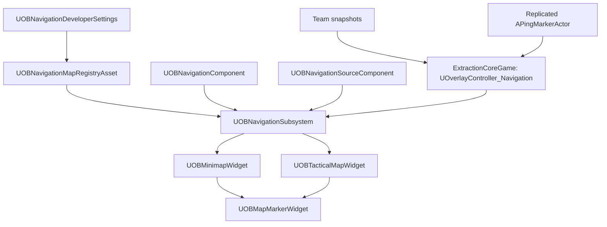

# OBNavigation Plugin

## Overview

**OBNavigation** is the reusable navigation UI core for OBExtraction. It provides map layers, minimap/full-map marker projection, marker pooling, visibility policy filtering, and data-driven marker configuration. Multiplayer ownership, team, ping, extraction, and loot rules are supplied by game-specific bridge code such as `ExtractionCoreGame`'s `UOverlayController_Navigation`.

The current V1 target is a **multiplayer top-down extraction shooter**:

- Local player marker on minimap.
- Squad-only teammate markers.
- Squad ping markers driven by replicated ping actors.
- Static or dynamic POI markers through `UOBNavigationSourceComponent`.
- Data-driven map layers and marker configs through a registry asset.
- No fog of war, path routing, or render-target map generation in this plugin.

## Key Features

- **Central subsystem:** `UOBNavigationSubsystem` owns map layers, active marker objects, projection utilities, visibility filtering, and marker lifetime cleanup.
- **Registry-driven setup:** `UOBNavigationMapRegistryAsset` lists map layers and marker configs keyed by `FGameplayTag`; `UOBNavigationDeveloperSettings` points the runtime to the default registry.
- **Marker spec API:** `FOBNavigationMarkerSpec` supports marker type, tracked actor, static location, lifetime, owner player id, team id, visibility policy, and sort priority.
- **Visibility policies:** `LocalOnly`, `SquadOnly`, `Public`, and `DebugOnly` prevent unwanted enemy markers from appearing by default.
- **Cook-friendly asset loading:** runtime loads from configured soft references instead of scanning all assets with `AssetRegistry`.
- **Minimap projection:** map panning, zooming, rotation, and player UV are driven through dynamic material parameters.
- **Widget pooling:** marker widgets are reused and removed when markers are no longer visible.
- **Extraction integration:** `ExtractionCoreGame` bridges team snapshots and replicated ping actors into this plugin.

## Architecture



`OBNavigation` remains game-agnostic. It does not decide who is a teammate, whether a ping is legal, or which extraction zones are active. Those rules belong in the game module and are submitted to the subsystem as marker specs.

## Module Dependencies

| Module | Type | Purpose |
|---|---|---|
| `Core` | Public | Core engine types |
| `DeveloperSettings` | Public | Project settings for default navigation registry |
| `GameplayTags` | Public | Marker type keys and integration with game tag systems |
| `UMG` | Public | Widget base classes |
| `CoreUObject` | Private | UObject support |
| `Engine` | Private | Actor, world, pawn, data asset support |
| `Slate` / `SlateCore` | Private | UI framework |

## Core API

### `UOBNavigationSubsystem`

The subsystem is the runtime source of truth for local navigation UI.

| Function | Description |
|---|---|
| `SetTrackedPlayerPawn(APawn*)` | Sets the pawn the minimap follows. |
| `SetLocalNavigationContext(int32 PlayerId, int32 TeamId)` | Sets local player/team context for visibility filtering. |
| `RegisterOrUpdateMarker(const FOBNavigationMarkerSpec&)` | Adds or updates a marker. Returns a stable `FGuid`. |
| `UnregisterMarker(const FGuid&)` | Removes a marker and its reverse actor lookup. |
| `GetVisibleMarkers(EOBNavigationSurface)` | Returns markers visible on Minimap, FullMap, or Compass after policy filtering. |
| `WorldToMapUVChecked(...)` | Converts world location to UV and returns a projection result enum. |
| `RegisterMapMarker(...)` / `UnregisterMapMarker(...)` | Legacy Blueprint-compatible wrappers. Prefer the marker spec API for new work. |

### `FOBNavigationMarkerSpec`

Use this when registering dynamic markers.

| Field | Meaning |
|---|---|
| `MarkerId` | Existing marker id to update; invalid means create new. |
| `MarkerType` | Gameplay tag used to resolve config from registry. |
| `LayerName` | Logical layer/group name such as `Squad`, `Pings`, `Extraction`. |
| `TrackedActor` | Optional actor to follow each tick. |
| `WorldLocation` / `WorldRotation` | Static fallback position and direction. |
| `ConfigAsset` | Optional direct config override. |
| `LifeTime` | Local lifetime when not owned by an external replicated actor. |
| `OwnerPlayerId` / `TeamId` | Used by visibility policies. |
| `VisibilityPolicy` | `LocalOnly`, `SquadOnly`, `Public`, or `DebugOnly`. |
| `SortPriority` | Higher priority markers render above lower priority markers. |

### `UOBNavigationSourceComponent`

Attach this to actors that should expose themselves as navigation POIs.

Important properties:

- `MarkerType`
- `MarkerConfig`
- `LayerName`
- `VisibilityPolicy`
- `bTrackOwner`
- `bRegisterOnBeginPlay`
- `OwnerPlayerId`
- `TeamId`
- `SortPriority`

Runtime methods:

- `RegisterOrUpdateNavigationMarker()`
- `UnregisterNavigationMarker()`
- `GetMarkerId()`

### `UOBNavigationComponent`

Attach to the local player character/pawn for standard self-marker behavior. It now registers only locally controlled characters as `LocalOnly`; replicated remote characters are not automatically shown. Teammates should come from the game bridge/controller, not from this component.

## Data Assets

### `UOBNavigationMapRegistryAsset`

Create one registry asset for the project or per game mode/map family.

- `MapLayers`: ordered at runtime by each layer's `Priority`.
- `MarkerConfigs`: maps `FGameplayTag` marker types to `UOBMarkerConfigAsset`.

Set the default registry in **Project Settings -> OB Navigation -> Default Map Registry**.

### `UOBMapLayerAsset`

Defines one map texture and its world bounds.

- `MapTexture`: top-down texture used by the minimap material.
- `WorldBounds`: world-space `FBox`; X/Y define projection coverage.
- `Priority`: higher priority wins when layers overlap.

### `UOBMarkerConfigAsset`

Defines marker visuals and surface visibility.

- `IdentifierIconTexture`
- `IndicatorMaterial`
- `IndicatorPivot`
- `Size`
- `Color`
- `Visibility`: minimap/full-map/compass booleans.
- `LifeTime`: local auto-remove timer. Use 0 for infinite or externally owned markers.

### `UOBMinimapConfigAsset`

Defines minimap rendering settings.

- `MinimapBackgroundMaterial`: must support `MapTexture`, `PlayerPositionUV`, `PlayerYaw`, `Zoom`, `MapRotationOffsetRad`, and `ShapeAlpha`.
- `Zoom`, `MinZoom`, `MaxZoom`
- `RotationSource`: for top-down shooters, `ActorRotation` is the recommended default.
- `bShouldRotateMap`
- `MapRotationOffset`
- `MapAlignment`
- `MinimapShape`
- `bShowDebugMessages`

## UI Widgets

### `UOBMinimapWidget`

Required child widgets:

- `MapImage`
- `MinimapMarkerCanvas`
- `CompassRingImage`

Runtime:

- Call `InitializeAndStartTracking(UOBMinimapConfigAsset*)` after creating/adding the widget.
- Call `SetMinimapZoom(float)` for runtime zoom.
- The widget unbinds subsystem delegates and clears marker widgets in `NativeDestruct`.

### `UOBTacticalMapWidget`

Full-map variant based on `UOBMinimapWidget`.

Blueprint-callable helpers:

- `AddZoomInput(float ZoomDelta)`
- `SetPanInput(FVector2D InPanInput)`
- `GetPanInput()`

V1 exposes pan/zoom state for UI input wiring. Full bespoke map interactions can be layered in Blueprint or extended in C++.

### `UOBMapMarkerWidget`

Required child widgets:

- `IdentifierIcon`
- `DirectionalIndicator`

Optional child widgets:

- `DistanceText`

Runtime methods:

- `InitializeMarker(UTexture2D*, UMaterialInterface*)`
- `UpdateVisuals(float IndicatorAngle, float ViewAngle, float ViewDistance)`
- `UpdateDistance(float DistanceMeters, bool bIsClampedToEdge)`

## ExtractionCoreGame Integration

`ExtractionCoreGame` depends on `OBNavigation` and adds `UOverlayController_Navigation`.

The controller bridges:

- `UOverlayController_Team` teammate snapshots -> squad-only teammate markers.
- replicated `APingMarkerActor` instances -> squad-only ping markers.
- local player/team context -> `UOBNavigationSubsystem::SetLocalNavigationContext`.
- possessed pawn -> `UOBNavigationSubsystem::SetTrackedPlayerPawn`.

To use it, add `UOverlayController_Navigation` to the HUD's `OverlayControllerClasses` in the project/HUD Blueprint. Configure marker tags and optional direct marker config overrides on the controller.

Ping safety is handled in `UPingComponent`:

- Client requests still originate from local trace.
- Server validates owner player id, ping tag validity, distance from pawn, and cooldown.
- Ping actors remain the replicated authoritative source; navigation only visualizes them.

## Using With ExtractionCoreGame

This README is the core plugin/API reference. For the production workflow that connects `OBNavigation` to `ExtractionCoreGame` systems such as `AExtractionHUD`, `UOverlayController_Navigation`, team snapshots, replicated pings, extraction zones, loot hotspots, and designer asset setup, use the runbook:

- [`Navigation_Integration_Guide.md`](../ExtractionCoreGame/Source/ExtractionCoreGame/Docs/Navigation_Integration_Guide.md)

Keep gameplay authority and filtering rules in `ExtractionCoreGame`; submit only approved marker specs or source components to `UOBNavigationSubsystem`.

## Integration Guide

1. Create map layer assets:
   - Create `UOBMapLayerAsset` assets.
   - Assign `MapTexture`.
   - Set `WorldBounds` accurately for the playable area.
   - Use `Priority` for overlapping indoor/floor/zone maps.

2. Create marker config assets:
   - Player marker.
   - Squad marker.
   - Ping marker.
   - Extraction, loot, objective, or debug marker configs as needed.
   - Set each config's minimap/full-map/compass visibility.

3. Create a registry asset:
   - Create `UOBNavigationMapRegistryAsset`.
   - Add all map layers.
   - Add marker config entries keyed by gameplay tags.
   - Set it in **Project Settings -> OB Navigation -> Default Map Registry**.

4. Setup player marker:
   - Add `UOBNavigationComponent` to the player character.
   - Assign `CharacterMapMarkerConfig`.
   - This only registers the locally controlled pawn.

5. Setup dynamic POIs:
   - Add `UOBNavigationSourceComponent` to extraction zones, loot hotspots, or objective actors.
   - Configure `MarkerType`, `LayerName`, `VisibilityPolicy`, and tracking behavior.

6. Setup minimap UI:
   - Reparent the minimap Blueprint to `UOBMinimapWidget`.
   - Add `MapImage`, `MinimapMarkerCanvas`, and `CompassRingImage`.
   - Set `MarkerWidgetClass`.
   - Call `InitializeAndStartTracking` with `UOBMinimapConfigAsset`.

7. Setup marker UI:
   - Reparent marker Blueprint to `UOBMapMarkerWidget`.
   - Add `IdentifierIcon` and `DirectionalIndicator`.
   - Optionally add `DistanceText` for edge-clamped markers.

8. Setup Extraction bridge:
   - Add `UOverlayController_Navigation` to `AExtractionHUD::OverlayControllerClasses`.
   - Configure teammate and ping marker tags/configs.
   - Ensure `UOverlayController_Team` and `UOverlayController_InRaidMain` remain registered; HUD ordering code keeps dependencies before navigation.

## Multiplayer Rules

- `OBNavigation` itself is local UI state, not a replicated authority.
- Replicated gameplay systems provide marker sources:
  - team snapshots for teammates,
  - `APingMarkerActor` for pings,
  - actor/source components for game POIs.
- Enemy actors are not shown automatically.
- Use `Public` only for markers that every local player should see.
- Use `SquadOnly` for team/ping data with valid `TeamId`.
- Use `LocalOnly` for self-only markers.
- Use `DebugOnly` for development markers controlled by `bShowDebugMarkers`.

## Coordinate System

`WorldToMapUVChecked` maps world coordinates into 0-1 texture UV:

- World `+Y` maps to horizontal `U`.
- World `+X` maps to vertical `V`.
- `V` is flipped so world `+X` appears at the top of the map by default.

If your map texture is authored with a different up-axis, adjust `MapAlignment` and `MapRotationOffset` in `UOBMinimapConfigAsset`.

Projection results:

- `Projected`
- `NoLayer`
- `OutsideLayer`
- `InvalidBounds`

Widgets should skip or clamp markers only after checking the projection result. The built-in minimap skips markers outside the active layer.

## Current Limitations

- No fog of war.
- No pathfinding or route drawing.
- No shared drawn routes.
- No render-target map capture.
- Full tactical map interaction is a V1 base class with zoom/pan hooks, not a finished map screen.
- Registry asset must be configured in Project Settings or marker tag lookup/map layers will be empty at runtime.

## Build Verification

Verified with:

```bash
bash /Users/phambaoai/UEProject/OBExtraction/run_build.sh
```

Result: `Succeeded`.

Known unrelated warning: `StructUtils` is deprecated in UE 5.5+ and is still referenced by the project/plugin setup.

## Versioning & Credits

- **Version:** 1.1
- **Created By:** OaiBa
