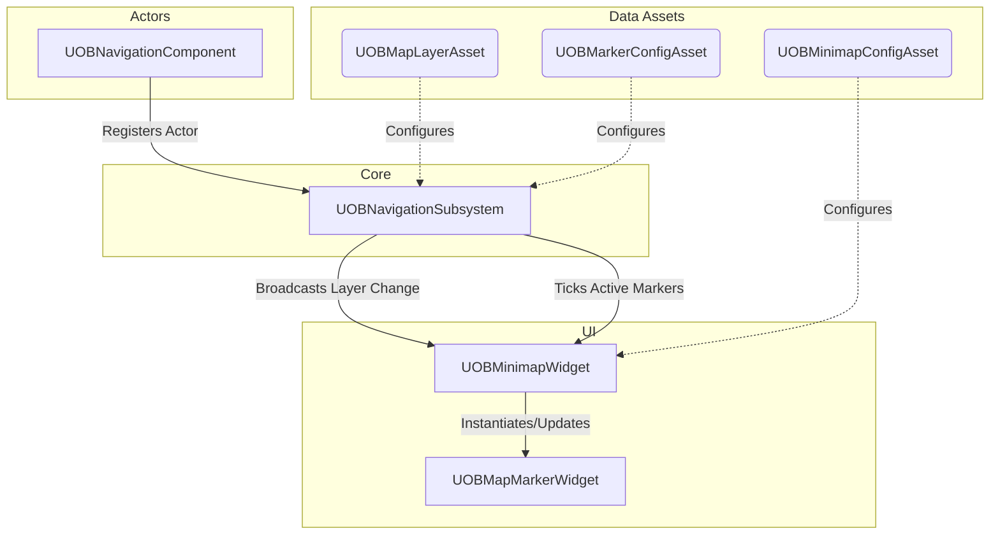
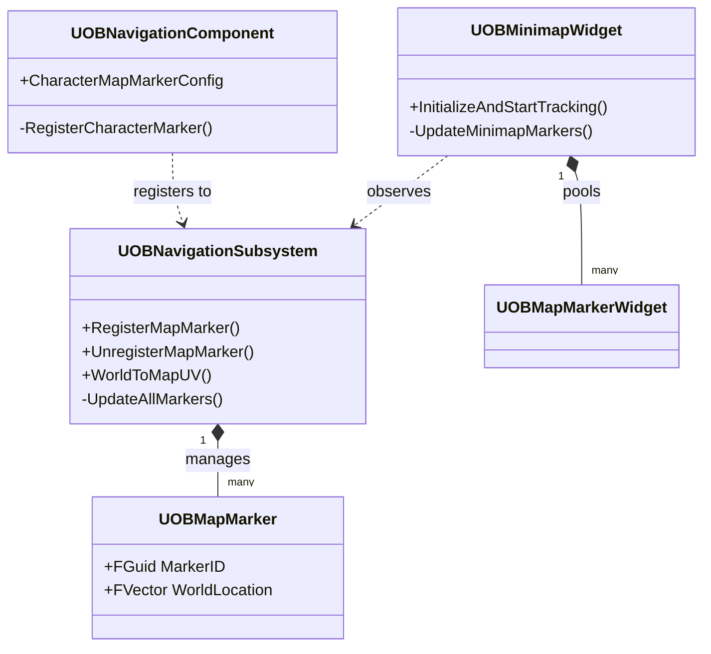

# OBNavigation Plugin

## Overview

**OBNavigation** is a comprehensive, production-ready navigation system for Unreal Engine 5. It provides a robust architecture for implementing Minimaps, Compasses, and World Maps with dynamic markers, multiplayer awareness, and data-driven configuration.

### Key Features
- **Centralized Subsystem Architecture:** `UOBNavigationSubsystem` acts as the single source of truth, minimizing per-tick overhead on individual actors.
- **Data-Driven Configuration:** Visual and behavioral settings are managed via `UDataAsset`, making it highly designer-friendly.
- **Optimized Rendering:** Minimap panning, zooming, and rotation are driven entirely by dynamic material parameters. Zero Render Target overhead.
- **Multiplayer Ready:** Designed with Dedicated Servers in mind. Markers are intelligently registered only where needed (Client/Proxy), skipping unnecessary server calculations.
- **Efficient Marker Management:** Uses an `FGuid`-based dictionary and widget pooling for O(1) lookups and minimized garbage collection.
- **Dynamic Layer Auto-Switching:** Supports multi-level maps (e.g., dungeons vs. overworld) with prioritized auto-switching based on world bounds.

---

## Architecture

### Data Flow

### Class Relationship

---

## Module Dependencies

| Module | Type | Description |
|---|---|---|
| `Core` | Public | Core engine types |
| `UMG` | Public | Unreal Motion Graphics for UI |
| `CoreUObject` | Private | UObject core features |
| `Engine` | Private | Core engine framework |
| `Slate` / `SlateCore`| Private | UI Framework |

---

## Class Reference

### Core Classes

#### `UOBNavigationSubsystem`
The central brain of the plugin. Inherits from `UGameInstanceSubsystem`.

| Function | Description |
|---|---|
| `SetTrackedPlayerPawn(APawn*)` | Sets the pawn the local minimap focuses on. |
| `RegisterMapMarker(...)` | Registers an actor/location to the map, returns `FGuid`. |
| `UnregisterMapMarker(FGuid)` | Removes a marker from the subsystem. |
| `WorldToMapUV(...)` | Converts a 3D World space coordinate to a 2D 0-1 UV map space. |

| Delegates | Description |
|---|---|
| `OnMinimapLayerChanged` | Fired when the player enters a new map layer boundary. |
| `OnMarkersUpdated` | Fired when markers are added, removed, or their logic states change. |

#### `UOBNavigationComponent`
An `UActorComponent` used to link game actors (like Characters) to the global subsystem.

| Property | Description |
|---|---|
| `CharacterMapMarkerConfig` | The `UOBMarkerConfigAsset` defining how this actor looks on the map. |
| `CharacterMapMarkerLayerName` | Logical grouping layer (e.g., "Players", "Enemies"). |

### Data Assets

#### `UOBMapLayerAsset`
Defines a specific map background and its real-world boundaries.
* **MapTexture:** 2D Top-down rendering of the level.
* **WorldBounds:** The `FBox` that the texture accurately covers.
* **Priority:** Higher priority layers are chosen when bounds overlap (e.g., inside a house vs. outside).

#### `UOBMarkerConfigAsset`
Defines visual properties and visibility rules for a marker.
* **IdentifierIconTexture:** The static main icon (e.g., a dot, skull).
* **IndicatorMaterial:** The rotating directional cone/arrow.
* **Visibility:** Struct (`FMarkerVisibilityOptions`) controlling Minimap, FullMap, and Compass toggles.
* **LifeTime:** Auto-destroy timer (0 = infinite).

#### `UOBMinimapConfigAsset`
Central config for the Minimap UI.
* **MinimapBackgroundMaterial:** The base material that handles panning/zoom mathematically.
* **Zoom:** Global map scale.
* **RotationSource:** Control Rotation vs Actor Rotation.
* **MinimapShape:** Circle vs Square masking.
* **MapAlignment:** Defines which world axis is "Up" (+X, +Y, -X, -Y).

### UI Widgets

#### `UOBMinimapWidget`
The core HUD element.
* **Required BindWidgets:** `MapImage`, `MinimapMarkerCanvas`, `CompassRingImage`.
* **Initialization:** Must call `InitializeAndStartTracking(UOBMinimapConfigAsset*)` manually after creation.

#### `UOBMapMarkerWidget`
The base class for individual icons on the map.
* **Required BindWidgets:** `IdentifierIcon`, `DirectionalIndicator`.

---

## Integration Guide

### Step 1: Create Data Assets
1. Right-click in Content Browser -> **Miscellaneous** -> **Data Asset**.
2. Create a `UOBMapLayerAsset`. Set your top-down texture and define the `WorldBounds` covering that area.
3. Create a `UOBMinimapConfigAsset`. Assign a material that accepts `PlayerPositionUV`, `PlayerYaw`, `Zoom`, and `MapRotationOffsetRad` parameters.
4. Create a `UOBMarkerConfigAsset` for your player icon.

### Step 2: Add Component to Character
1. Open your Player Character Blueprint.
2. Add a `OBNavigationComponent`.
3. In its properties, assign the `CharacterMapMarkerConfig` you created in Step 1.

### Step 3: Setup Minimap UI
1. Create a new Widget Blueprint, reparent it to `UOBMinimapWidget`.
2. Add an Image named `MapImage` (for the map material).
3. Add a CanvasPanel named `MinimapMarkerCanvas` (where icons will spawn).
4. Add an Image named `CompassRingImage` (for the border).
5. In your PlayerController or HUD, Create this Widget, Add to Viewport, and call **`InitializeAndStartTracking`**, passing your `UOBMinimapConfigAsset`.

### Step 4: Setup Marker UI
1. Create a new Widget Blueprint, reparent it to `UOBMapMarkerWidget`.
2. Add an Image named `IdentifierIcon` (Size it accordingly).
3. Add an Image named `DirectionalIndicator` (Make sure its pivot is set to `0.5, 0.5`).
4. In your Minimap Widget Blueprint, set this new class to the `MarkerWidgetClass` property.

---

## Multiplayer Considerations

- **Server Optimization:** Dedicated servers (`NM_DedicatedServer`) actively skip tracking local pawns and registering unnecessary UI markers.
- **Client Synchronization:** Marker lifetimes (like pings) tick globally. However, spatial and visual updates are purely client-side logic.
- **Replication:** The `OBNavigation` system itself does not handle network replication. You should attach `UOBNavigationComponent` to replicated Actors, and the client will automatically visualize them based on their local network proxies.

---

## Coordinate System

The plugin handles the complex math of converting World Space to 2D Map Space via `WorldToMapUV`:
- Unreal World `+Y` (Right) maps to the `U` coordinate.
- Unreal World `+X` (Forward) maps to the `V` coordinate.
- Because texture `V=0` is at the top, the logic naturally flips the `X` axis so North (+X) points Up on the Minimap.

If your game uses a different layout (e.g., +Y is Forward), adjust the `MapAlignment` property in the `UOBMinimapConfigAsset`.

---

## Versioning & Credits
- **Version:** 1.0
- **Created By:** OaiBa