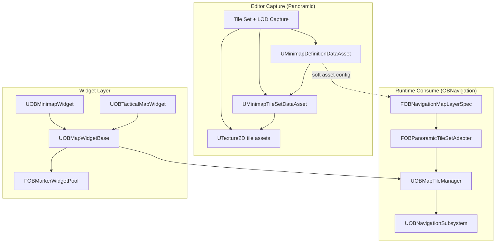

# Tiled Minimap & Navigation Map Layer Plan

Update OBNavigation to consume the current Panoramic Tile Set + LOD output directly. Panoramic is now the editor-time capture and asset-authoring source of truth; Navigation should not create a second tile asset schema or slice full-resolution captures again.

## Current Panoramic Output Contract

`OBPanoramicMinimapGenerator` exports runtime assets in `PanoramicMinimapGeneratorRuntime`:

- `UMinimapDefinitionDataAsset`
  - `BaseMapTexture`: optional full-resolution texture for legacy/small maps.
  - `TileSet`: soft reference to `UMinimapTileSetDataAsset` when Tile Set + LOD export is enabled.
  - `WorldBounds`, `OutputSize`, `MapRotationDegrees`, `bClampQueriesToBounds`, `OverlayLayers`.
  - Capture metadata: `CaptureRunId`, `CaptureDisplayName`, `SourceMapPackage`, `SourceMapName`, `CaptureTimestampUtc`, `CaptureBounds`, `CaptureOutputSize`, `CaptureTileResolution`, `CaptureTileOverlap`, `CaptureTileSetMaxLOD`, `CaptureTileSetWorldTileSize`.
- `UMinimapTileSetDataAsset`
  - `WorldBounds`, `OutputSize`, `MapRotationDegrees`, `bClampQueriesToBounds`.
  - `PyramidLevels: TArray<FMinimapTilePyramidLevel>`.
  - Same capture metadata as the definition asset.
- `FMinimapTilePyramidLevel`
  - `LOD`: `0` is overview/lowest resolution, `GetMaxLOD()` is the most detailed level.
  - `GridDimensions`, `TilePixelSize`, `WorldTileSize`, `LogicalPixelSize`.
  - `Tiles: TArray<FMinimapTileRef>`.
- `FMinimapTileRef`
  - `Coord` (`LOD`, `X`, `Y`), `Texture` soft reference, `ValidPixelMin`, `ValidPixelMax`, `WorldBounds`, `UVMin`, `UVMax`.

Panoramic package layout for Tile Set + LOD:

```text
<DefinitionAssetPath>/<RunId>/
  DA_<RunId>
  DA_<RunId>_TileSet
  Tiles/
    LOD_<LOD>/
      T_<RunId>_L<LOD>_X<X>_Y<Y>
```

`RunId` format:

```text
<SafeFileName>_<SafeMapName>_<YYYYMMDD_HHMMSS>[_001...]
```

This means every capture run is isolated and Navigation can distinguish map, bounds, capture time, settings, and tile soft paths from the assets alone.

## Architecture Overview



## Key Decisions

1. Navigation uses `UMinimapDefinitionDataAsset` as the map-layer input.
2. Navigation uses `UMinimapTileSetDataAsset` and `FMinimapTileRef` directly; no `UOBMapTileSetAsset` duplicate.
3. Tile textures remain individual `UTexture2D` assets behind soft references. Navigation controls runtime load/unload with `FStreamableManager`.
4. LOD index semantics follow Panoramic: `LOD 0` is overview, `MaxLOD` is highest detail.
5. Tile selection should use Panoramic UV/world bounds data (`UVMin`, `UVMax`, `WorldBounds`) instead of recalculating a separate grid unless needed for fast lookup.
6. Legacy single-texture layers remain supported through `BaseMapTexture` or existing `MapTexture`.

## Required Module Dependency

Update `OBNavigation.Build.cs`:

```csharp
PrivateDependencyModuleNames.AddRange(new string[]
{
    "PanoramicMinimapGeneratorRuntime"
});
```

Use a private dependency first. Move to public only if OBNavigation public headers expose Panoramic types directly.

## Proposed Changes

### Phase 1: Map Layer Contract

Modify `FOBNavigationMapLayerSpec` in `OBNavigationTypes.h` to support Panoramic definitions:

```cpp
UPROPERTY(EditAnywhere, BlueprintReadWrite, Category = "OBNavigation|Map")
TSoftObjectPtr<UMinimapDefinitionDataAsset> PanoramicDefinition;

bool HasPanoramicDefinition() const
{
    return !PanoramicDefinition.IsNull();
}

bool IsTiledLayer() const
{
    const UMinimapDefinitionDataAsset* Definition = PanoramicDefinition.Get();
    return Definition && !Definition->TileSet.IsNull();
}
```

Keep existing `MapTexture` for compatibility. Resolution order:

1. If `PanoramicDefinition` is set and has `TileSet`, use tiled streaming.
2. Else if `PanoramicDefinition` has `BaseMapTexture`, use it as single-texture layer.
3. Else use existing `MapTexture`.

### Phase 2: Runtime Adapter

Add a small adapter rather than copying Panoramic data:

```cpp
struct FOBPanoramicTileSetRuntimeView
{
    TWeakObjectPtr<const UMinimapDefinitionDataAsset> Definition;
    TWeakObjectPtr<const UMinimapTileSetDataAsset> TileSet;
    FBox WorldBounds = FBox(ForceInit);
    FIntPoint OutputSize = FIntPoint::ZeroValue;
    float MapRotationDegrees = 0.0f;
    FString CaptureRunId;
};
```

Responsibilities:

- Load `UMinimapDefinitionDataAsset`.
- Load `Definition->TileSet` only when tiled rendering is requested.
- Validate `TileSet->IsValidTileSet()`.
- Expose `GetMaxLOD()`, `GetPyramidLevel(LOD)`, and capture metadata to Navigation diagnostics.

Do not create new editor-only conversion assets.

### Phase 3: Tile Manager

Create `UOBMapTileManager` owned by `UOBNavigationSubsystem` or per active map widget.

Core responsibilities:

- Initialize from `UMinimapDefinitionDataAsset`.
- Resolve visible tiles for a world-space or UV-space viewport.
- Async load required `FMinimapTileRef::Texture` soft refs.
- Keep hard references only for active and recently-used tiles.
- Evict LRU tiles using a configurable budget.
- Expose active tile draw data to widgets.

Suggested draw state:

```cpp
struct FOBActiveMapTile
{
    FMinimapTileCoord Coord;
    FBox WorldBounds;
    FVector2D UVMin = FVector2D::ZeroVector;
    FVector2D UVMax = FVector2D::ZeroVector;
    TSoftObjectPtr<UTexture2D> TextureRef;
    TObjectPtr<UTexture2D> Texture = nullptr;
};
```

Recommended manager API:

```cpp
void Initialize(TSoftObjectPtr<UMinimapDefinitionDataAsset> InDefinition);
void Shutdown();

int32 GetMaxLOD() const;
int32 ChooseLODForWorldUnitsPerPixel(float RequestedWorldUnitsPerPixel) const;

void UpdateActiveTilesByUVRect(const FVector2D& UVMin, const FVector2D& UVMax, int32 RequestedLOD);
void UpdateActiveTilesByWorldBounds(const FBox2D& WorldBounds, int32 RequestedLOD);

const TArray<FOBActiveMapTile>& GetActiveTiles() const;
const UMinimapDefinitionDataAsset* GetDefinition() const;
const UMinimapTileSetDataAsset* GetTileSet() const;
```

Tile intersection should mirror Panoramic's `GetTilesIntersectingUVRect` behavior:

- Normalize swapped min/max.
- Clamp to `[0,1]` when `bClampQueriesToBounds` is enabled.
- Select tiles whose `Coord.X/Y` intersect the requested level range.
- Prefer using each tile's stored `UVMin/UVMax` for rendering.

### Phase 4: LOD Policy

Use Panoramic's existing LOD pyramid:

- `LOD 0`: overview, usually one or few low-res tiles.
- Intermediate LODs: progressively denser grids.
- `TileSet->GetMaxLOD()`: full detail, generated from `TileSetWorldTileSize`.

Minimap policy:

- Usually request `MaxLOD`.
- If the minimap radius is large or widget size is small, use `ChooseLODForWorldUnitsPerPixel()` to reduce tile count.

Tactical map policy:

- Compute world units per screen pixel from current zoom/viewport.
- Request nearest LOD via `ChooseLODForWorldUnitsPerPixel()`.
- Clamp to valid levels in `TileSet->PyramidLevels`.

Avoid hard-coded zoom thresholds like "Zoom <= 0.5 means LOD 0"; the actual grid depends on Panoramic settings and capture bounds.

### Phase 5: Widget Rendering

`UOBMapWidgetBase` should support two render paths:

1. Single texture path:
   - Existing `MapTexture` material parameter.
   - Used by old layers and Panoramic definitions without `TileSet`.
2. Tiled path:
   - Query `UOBMapTileManager` for active tiles.
   - Render tiles as layered image widgets or Slate draw elements.
   - Position each tile from `FMinimapTileRef::UVMin/UVMax` relative to the current view rect.

Prefer direct tile widgets/Slate draw elements over compositing into one render target for the first implementation. It avoids render-target churn and preserves per-tile streaming visibility. Composite render target can be added later if the existing material pipeline requires one texture.

Rendering math:

- Convert world location to map UV using the same convention as Panoramic:
  - `U = (World.X - Bounds.Min.X) / Bounds.Size.X`
  - `V = 1 - ((World.Y - Bounds.Min.Y) / Bounds.Size.Y)`
- Apply `MapRotationDegrees` consistently with existing OBNavigation map rotation.
- Tile screen rect comes from intersecting tile `UVMin/UVMax` with current view UV rect.

### Phase 6: Marker Optimization

This remains useful and independent of tile streaming.

Add `FOBMarkerSpatialGrid`:

```cpp
class OBNAVIGATION_API FOBMarkerSpatialGrid
{
public:
    void Initialize(const FBox& WorldBounds, float CellSize);
    void InsertMarker(const FGuid& MarkerID, const FVector& WorldLocation);
    void UpdateMarker(const FGuid& MarkerID, const FVector& OldLocation, const FVector& NewLocation);
    void RemoveMarker(const FGuid& MarkerID, const FVector& WorldLocation);
    void QueryMarkersInBounds(const FBox2D& QueryBounds, TArray<FGuid>& OutMarkerIDs) const;
    void Clear();

private:
    FIntPoint WorldToCell(const FVector& WorldLocation) const;
    TMap<FIntPoint, TArray<FGuid>> CellMap;
    FBox WorldBounds = FBox(ForceInit);
    float CellSize = 1000.0f;
};
```

Cell size should default to Panoramic's `CaptureTileSetWorldTileSize` when available. Otherwise use `1000.0f`.

Add `FOBMarkerWidgetPool`:

- Acquire/release `UOBMapMarkerWidget` instead of create/destroy per visibility change.
- Keep widget count stable while panning/zooming.

Add projection cache:

```cpp
struct FOBCachedProjection
{
    FVector2D CachedMapUV = FVector2D::ZeroVector;
    FVector LastProjectedWorldLocation = FVector::ZeroVector;
    float LastZoom = -1.0f;
    float LastRotation = -1.0f;
    bool bIsDirty = true;
};
```

Static markers only reproject when the view changes enough. Dynamic tracked markers update position every frame or via a small movement threshold.

## Removed From Previous Plan

Do not implement these as part of Navigation:

- `FOBMapTileExporter`
- `FOBTilePyramidBuilder`
- `UOBMapTileSetAsset`
- `FOBTilePyramidLevel` duplicate schema
- Any editor utility that slices a full `BaseMapTexture` into tiles

Panoramic already owns this pipeline and writes the complete tile pyramid and metadata.

## Verification Plan

### Build

```bash
bash /Users/phambaoai/UEProject/OBExtraction/run_build.sh
```

### Asset Contract

- Capture Tile Set + LOD twice with the same `FileName`.
- Verify two different `CaptureRunId` folders are created.
- In Navigation, assign each `UMinimapDefinitionDataAsset` to a map layer and verify it resolves its own `TileSet` and tile soft paths.
- Confirm `CaptureRunId`, `SourceMapPackage`, `SourceMapName`, `CaptureBounds`, and tile settings display correctly in debug logs/UI.

### Tile Runtime

- Load a tiled definition with 421 refs.
- Verify `TileSet->GetMaxLOD()` returns the full-detail level.
- Query a small minimap view and confirm only intersecting high-detail tiles are loaded.
- Query a full tactical-map view and confirm overview/intermediate LOD is selected instead of loading all full-detail tiles.
- Pan across tile boundaries and verify no missing tiles or incorrect `Y` orientation.

### Backward Compatibility

- Existing single-texture map layer still renders.
- Panoramic definition with only `BaseMapTexture` still renders as a single texture.
- Runtime marker projection remains correct for both single-texture and tiled maps.

### Performance

- Keep default loaded tile budget around 25 tiles for minimap/high-detail usage.
- Use async streaming for tile textures.
- Confirm active widget count stays stable under marker stress tests.
- Use `stat memory`, `stat streaming`, and `stat slate` during tactical pan/zoom.

## Delivery Summary

| Phase | Scope | New Files | Modified Files | Risk |
|---|---|---|---|---|
| 1 | Add Panoramic definition input to map layer spec and module dependency | 0 | `OBNavigation.Build.cs`, `OBNavigationTypes.h` | Low |
| 2 | Runtime adapter around `UMinimapDefinitionDataAsset` / `UMinimapTileSetDataAsset` | 1 | Subsystem init path | Low |
| 3 | Tile manager with async soft-ref loading and LRU budget | 1-2 | `OBNavigationSubsystem` | Medium |
| 4 | Widget tiled render path for minimap/tactical map | 0 | `OBMapWidgetBase`, minimap/tactical widgets | Medium |
| 5 | Marker spatial grid, widget pool, projection cache | 2 | subsystem/widgets | Low |
| 6 | Tests, profiling, debug UI/logging for run metadata | 0-1 | test/debug files | Low |

Recommended implementation order: Phase 1 -> Phase 2 -> Phase 3 -> Phase 4, then marker optimization. This gets Navigation reading real Panoramic output before optimizing the marker layer.
